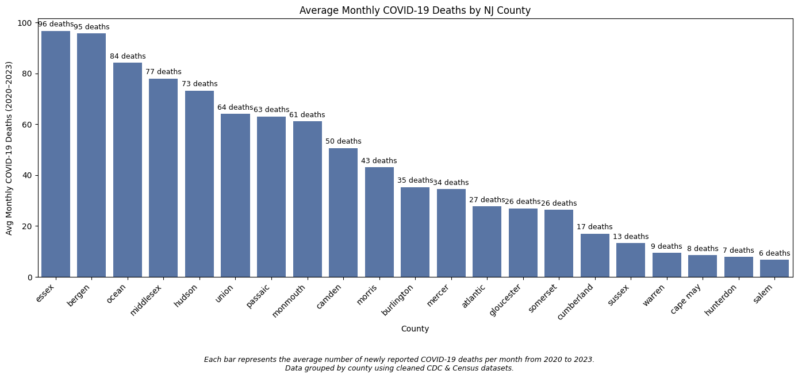
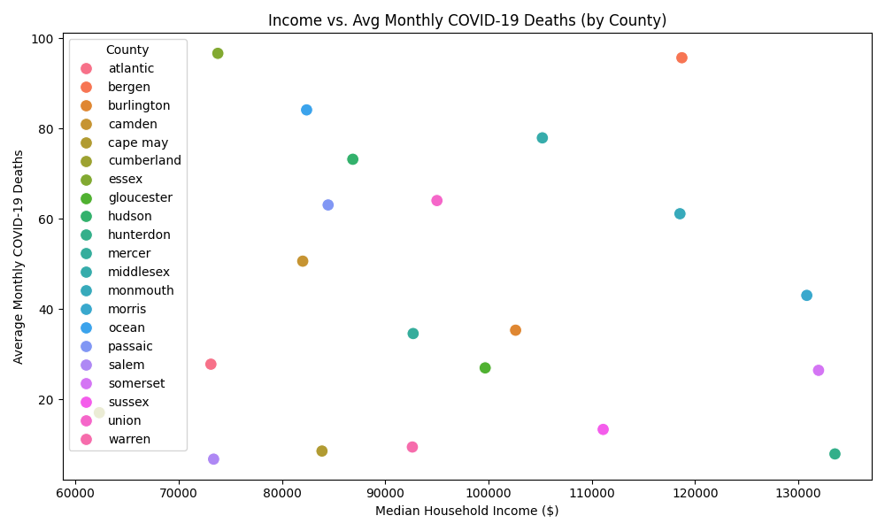
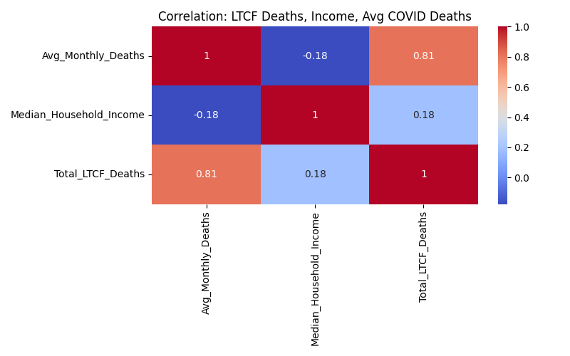

# 🩺 COVID-19 Healthcare Impact in New Jersey  
_A Data Cleaning & Analysis Project_

---

## 🎯 Project Purpose

This project investigates how COVID-19 impacted healthcare systems and outcomes across counties in New Jersey. By combining data from federal and state health sources, the goal is to uncover how death rates, LTCF (Long-Term Care Facility) deaths, and county income levels are interrelated.

---

## ❓ Key Questions to Answer During Analysis

- What counties experienced the **highest COVID-19 death rates**?
- Is there a relationship between **income level** and **COVID-19 mortality**?
- How did **long-term care facilities** contribute to total death counts?
- Which counties were **most vulnerable** based on combined metrics?

---

## 📂 Datasets Used

| Dataset                                 | Source                                                                                          | Description                                     |
|----------------------------------------|-------------------------------------------------------------------------------------------------|-------------------------------------------------|
| `US_COVID_Deaths_Cleaned.csv`          | [CDC - COVID-19 Deaths by County](https://data.cdc.gov/NCHS/Provisional-COVID-19-Death-Counts-by-County-and-Race/k8wy-p9cg) | County-level death counts filtered for NJ       |
| `NJ_Median_Income_by_County.csv`       | [U.S. Census Bureau](https://www.census.gov/data.html)                                          | Median household income by NJ county            |
| `NJ_LTCF_COVID_Outbreaks.csv`          | [NJ DOH LTCF Report](https://www.nj.gov/health/)                                                | Resident and staff death counts in LTCF facilities |

---

## 🛠 Tools Used

- **KNIME Analytics Platform** – for data cleaning  
- **Python (Pandas, Seaborn, Matplotlib)** – for analysis and visualizations  
- **GitHub** – for version control and portfolio documentation  
- **Command Prompt** – for file management and execution  
- **Notepad** – for markdown and script editing  

---

## 📊 Visual Insights

### 🔹 Bar Chart: Avg Monthly COVID-19 Deaths by County

- Depicts **monthly COVID-19 death averages** (not cumulative).
- Shows impact across counties like **Bergen**, **Essex**, and **Hudson**.
- Values are based on CDC cumulative data converted to daily deltas and averaged by month.

---

### 🔹 Scatter Plot: Median Income vs. Avg Monthly COVID-19 Deaths

- Plots **income** vs **monthly COVID deaths** to reveal inverse correlation.
- Lower-income counties like **Essex** saw higher death averages.
- Higher-income counties like **Hunterdon** show lower death rates.

---

### 🔹 Correlation Heatmap: LTCF Deaths, Income, Avg COVID Deaths

- Strong positive correlation between **LTCF deaths** and **avg monthly deaths** (`0.81`)
- Weak negative correlation between **income** and **COVID-19 deaths** (`-0.18`)
- Demonstrates LTCF impact is a more significant factor than income alone

---

## 💡 Insights Summary

- **LTCF deaths** are a key driver of overall mortality in some counties.
- **Income alone** is not a strong predictor of COVID-19 death outcomes.
- Combining LTCF, income, and death data provides a richer picture of health vulnerability.

---

## 🧠 What I Learned

- Data wrangling and cleaning with KNIME  
- Dataset merging and correlation analysis with Pandas  
- Creating insightful charts with Seaborn and Matplotlib  
- Organizing real-world health data into a clean storytelling portfolio  

---

## 🚧 Next Steps (Phase 3 Planning)

- [ ] Analyze ICU utilization from NJ Hospital dataset  
- [ ] Detect county-level risk clusters using unsupervised learning  
- [ ] Develop a dynamic dashboard using Streamlit or Tableau  

---

## 📌 Summary

This project demonstrates foundational data analytics, public health insight, and storytelling. Phase 1 and 2 have covered county-level mortality, income impact, and LTCF vulnerability. Phase 3 will build on this foundation with advanced analysis and interactivity.

📁 [View Repository](https://github.com/Margaret-Johnson-ai/Data-Analytics-Portfolio/tree/main/COVID_Healthcare_Impact)
