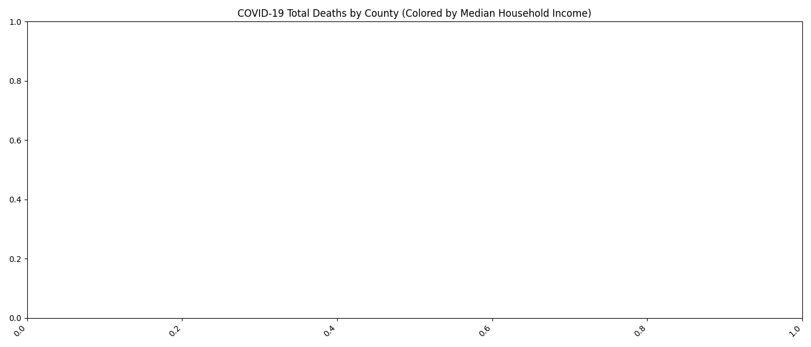

# 🩺 COVID-19 Healthcare Impact in New Jersey  
_A Data Cleaning & Analysis Project_

---

## 🎯 Project Purpose

This project investigates how COVID-19 impacted healthcare systems and outcomes across counties in New Jersey. By combining data from federal and state health sources, the goal is to uncover how death rates, hospital resource usage, and county income levels are interrelated.

---

## ❓ Key Questions to Answer During Analysis

- What counties experienced the **highest COVID-19 death rates**?
- Is there a relationship between **income level** and **COVID-19 mortality**?
- Did counties with **higher ICU utilization** experience more fatalities?
- Which counties were **most vulnerable** based on combined metrics?

These questions will be addressed during the Exploratory Data Analysis (EDA) phase.

---

## 📂 Datasets Used

| Dataset                                 | Source                                                                                          | Description                                     |
|----------------------------------------|-------------------------------------------------------------------------------------------------|-------------------------------------------------|
| `US_COVID_Deaths_Cleaned.csv`          | [CDC - COVID-19 Deaths by County](https://data.cdc.gov/NCHS/Provisional-COVID-19-Death-Counts-by-County-and-Race/k8wy-p9cg) | County-level death counts filtered for NJ       |
| `NJ_Hospital_Utilization.csv`          | [NJ Department of Health](https://www.nj.gov/health/)                                           | ICU/general bed occupancy trends                |
| `NJ_Median_Income_by_County.csv`       | [U.S. Census Bureau](https://www.census.gov/data.html)                                          | Median household income by NJ county            |

---

## 🛠 Tools Used

- **KNIME Analytics Platform** – for data cleaning, workflow design, and automation  
- **Python** – for CSV validation and previewing cleaned datasets  
- **GitHub** – for version control, project portfolio, and documentation  
- **Command Prompt (CMD)** – for Git operations and local repository management  
- **Notepad** – for quick edits to markdown files and manual code updates

---

## 📸 Project Screenshots

### 🧼 Dataset 1: NJ Long-Term Care Facility Outbreaks

  
  
  
  
  
  
  
  
  
  
  
  

---

### 🧼 Dataset 2: NJ Median Household Income

  
  
  
  
  
  
  
  

---

### 🧼 Dataset 3: US COVID Deaths by County (NJ Only)

/01_Read_US_COVID_Deaths_CSV.png.png)  
/02_Filter_New_Jersey_Rows.png.png)  
/03_Remove_Unnecessary_Columns_Deaths.png.png)  
/04_Rename_Admin2_To_County.png.png)  
/05_Handle_Missing_Values_Deaths.png.png)  
/06_Save_Cleaned_US_Deaths_CSV.png.png)

---

## 📊 Exploratory Data Analysis (EDA)

### COVID-19 Total Deaths vs. Median Household Income

- Counties with **lower median household incomes** experienced **higher total COVID-19 deaths**.
- The bar chart reveals a potential **negative correlation** between income level and pandemic outcomes.
- This insight highlights how **socioeconomic factors** may influence vulnerability during health crises.

**Data Sources:**
- [CDC COVID-19 Deaths by County](https://data.cdc.gov/NCHS/Provisional-COVID-19-Death-Counts-by-County-and-Ra/k8wy-p9cg)
- [U.S. Census Bureau – Median Household Income](https://www.census.gov/)

---

## 🧠 What I Learned

- How to structure, filter, and clean public health datasets in KNIME  
- How to apply logic nodes, string manipulation, and regex in workflows  
- How to document the full process using GitHub with screenshots and commits  
- How to visualize real-world healthcare patterns using Python and Seaborn

---

## 🚧 Next Steps (Phase 2: Exploratory Data Analysis – EDA)

✅ Bar chart: COVID deaths vs income by county  
- [ ] Correlation heatmaps: death rate, ICU use, income  
- [ ] Identify county-level risk clusters  
- [ ] Add remaining visuals to `EDA_Visuals/` and document findings

---

## 📌 Summary

This project demonstrates practical skills in real-world data cleaning, exploratory analysis, documentation, and portfolio storytelling. I've completed the first visual insight showing the relationship between county income and COVID-19 deaths, and will continue analyzing healthcare impact using additional statistical and visual tools.

Stay tuned for heatmaps, correlations, and deeper insights in the next push!
